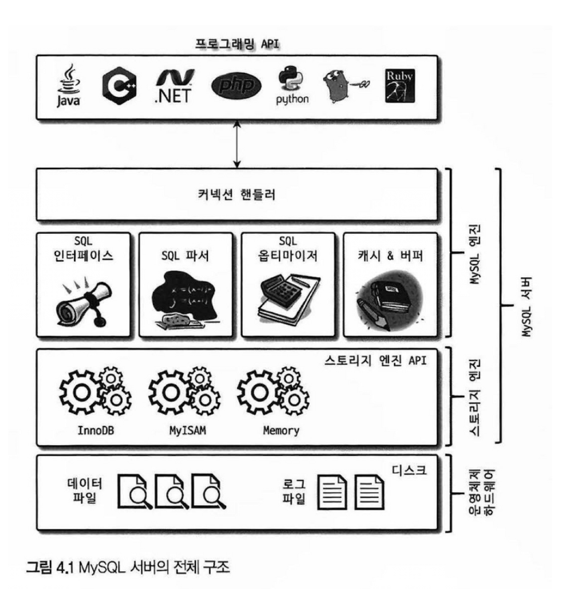

**~ 4장, ~95p**

# 4. MySQL 아키텍처

MySQL서버는 `MySQL Engine`과 `Storage Engine`으로 구성 되어 있습니다.

| 비교 | MySQL Engine                                        | Storage Engine                                           |
| ---- | --------------------------------------------------- | -------------------------------------------------------- |
| 설명 | MySQL Engine은 `SQL 처리/최적화` 등을 담당하는 두뇌 | Storage 엔진은 실제 데이터를 `디스크에 저장`하는 팔/다리 |
| 예시 | 옵티마이저, 핸들러, 전처리기                        | InnoDB, MyISAM, Memory                                   |

 

# 4.1. MySQL Engine

1. 핸들러 API
2. 스레딩 구조
3. 메모리 할당 및 사용 구조
4. 플러그인 스토리지 엔진
5. 쿼리 실행 구조
6. 쿼리 캐시
7. 트랜잭션 지원 메타데이터

## 4.1.1 핸들러 API

MySQL 엔진에서 데이터를 읽고 쓸 때 스토리지 엔진에 요청하는 API를 핸들러 API라고 합니다.

## 4.1.2 스레딩 구조

- 클라이언트의 각 연결마다 `스레드`를 할당하여 동시 처리를 가능하게 하는 구조

### 포그라운드 스레드

- 클라이언트 사용자가 요청하는 쿼리 문장을 처리하는 스레드
- 사용자 스레드
- 커넥션 종료 시, 스레드 캐시에 되돌아갑니다.
- ex) 사용자의 Select 조회 요청 처리 등

### 백그라운드 스레드

- 시스템 내부의 작업을 처리하는 스레드
- 시스템 스레드
- ex) 데이터를 디스크에 반영

## 4.1.3 메모리 할당

### 글로벌 메모리 영역

- 모든 스레드에 공유
- 테이블 캐시, 버퍼 풀, 어댑티브 해시 인덱스, 리두 로그버퍼 등

### 로컬 메모리 영역

- 클라이언트 커넥션 별 `독립적`인 영역
- 정렬 버퍼, 조인 버퍼, 바이너리 로그 캐시, 네트워크 버퍼 등

## 4.1.4 플러그인 스토리지 엔진

### 스토리지 엔진

- 데이터를 `물리적으로 저장`하고 관리하는 핵심 컴포넌트입니다.
- MySQL 서버와 실제 데이터 파일 사이의 중간 계층 역할
- InnoDB, myIsam등

이러한 스토리지 엔진을 플러그인화하여, 갈아끼는 방식을 채택합니다.

## 4.1.5 쿼리 실행 구조

#### 1. 쿼리 파서

- 쿼리 문장을 트리형태로 토큰화하여, 문법 오류 검증

#### 2. 전처리기

- 파서를 통해 만든 트리를 기반으로 쿼리 문장에 구조적인 문제점이 있는지 확인

#### 3. 옵티마이저

- 가장 저렴한 비용으로 쿼리를 처리하는 것을 결정

#### 4. 실행 엔진

- 만들어진 계획대로 각 핸들러에게 요청한 결과를 또 다른 핸들러 요청으로 연결하는 역할 수행

#### 5. 핸들러

- 실행엔진의 요청에 따라 데이터를 `디스크`로 `저장`하고, `읽어`오는 역할

## 4.1.6 쿼리 캐시

- SQL 실행 결과를 메모리에 캐싱
- 캐시 히트가 높으면 조회 성능이 향상되었으나, 데이터 갱신 시에 캐시 `일관성`을 유지하는데 큰 비용으로 인해 8.0에서는 삭제되었습니다.

## 4.1.6 트랜잭션 지원 메타데이터

- 테이블의 구조 정보 등의 메타 데이터에 대한 트랜잭션이 8.0부터 지원됩니다.
- 의도치 않게 mysql 서버가 종료되면 일관되지 않은 상태로 남는 문제가 있었으나, 이젠 트랜잭션을 지원하여, 롤백 등을 수행해 일관성을 보장합니다.
- 데이터의 일관성을 위해 트랜잭션을 지원하여 약간의 오버헤드가 생기는 trade off 사례입니다.
