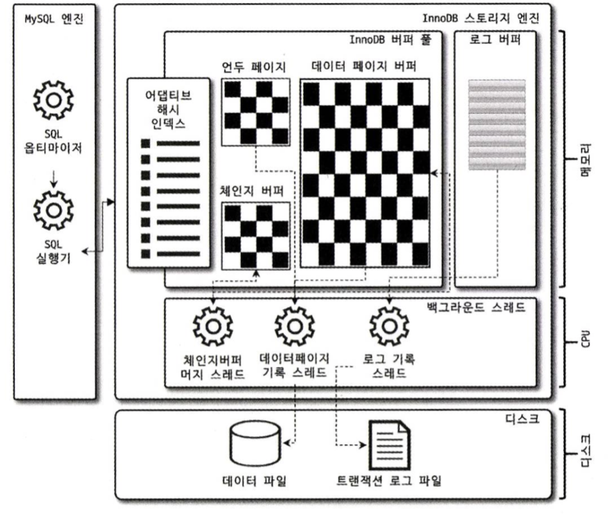

**~ 95p ~ 4장 끝 **

# 4. MySQL 아키텍처

MySQL서버는 `MySQL Engine`과 `Storage Engine`으로 구성 되어 있습니다.

| 비교 | MySQL Engine                                        | Storage Engine                                           |
| ---- | --------------------------------------------------- | -------------------------------------------------------- |
| 설명 | MySQL Engine은 `SQL 처리/최적화` 등을 담당하는 두뇌 | Storage 엔진은 실제 데이터를 `디스크에 저장`하는 팔/다리 |
| 예시 | 옵티마이저, 핸들러, 전처리기                        | InnoDB, MyISAM, Memory                                   |

<br>

# 4.2. InnoDB 스토리지 엔진 아키텍처

스토리지 엔진중 거의 유일하게 레코드 기반의 잠금을 제공해 높은 동시성 처리, 안정적, 성능이 뛰어난 이점이 있습니다.



1. PK 클러스터링
2. FK 지원
3. MVCC와 잠금 없는 일관된 읽기
4. 자동 데드락 감지
5. InnoDB 버퍼 풀
6. Double Write Buffer
7. Undo log
8. Adaptive Hash Index

<br>

## 4.2.1 PK 클러스터링

- 테이블 데이터가 기본키(PK)를 기준으로 클러스터링되어 저장되는 구조로, PK 기반 검색이 매우 빠릅니다.
- 클러스터링 되어 PK값에 따라 물리적으로 디스크에 저장된다는 것이며, 페이지 단위로 여러 묶음씩 캐싱하며 조회할 수 있어 공간지역성의 이점을 받습니다.
- DBMS에서 삭제를 지양하는 이유 중 하나입니다.

<br>

## 4.2.2 FK 지원

- InnoDB는 FK를 지원하여 데이터 무결성을 보장할 수 있습니다.
  MyIsam과 같은 엔진은 지원하지 않기 때문에 무결성을 보장하고 싶다면, 어플리케이션 레벨 구현해줘야합니다.

  <br>

## 4.2.3 MVCC와 잠금 없는 일관된 읽기

- Multi Version Concurrency Control
- 잠금을 사용하지 않고 `일관된` 읽기를 제공합니다.

<br>
격리수준 ReadCommited 가정한 MVCC(커밋되지 않은 데이터를 읽어오는 것을 방지)

```
// 메모리에 저장해둠
insert into member values (12, '홍길동', '서울')

// 이 시점에 디스크에 저장
COMMIT
```

이를 수행하면,삽입한 데이터가 메모리(버퍼풀)와 디스크에 존재하게 됩니다

```
update member set m_area = '경기' where m_id = 12;
```

위의 업데이트를 기존의 내용을 언두로그라는 곳에 저장하고, 버퍼풀에 해당 내용이 반영됩니다.


위의 상황에서 위의 데이터를 조회한다면 어떻게 될까요?

```
SELECT * FROM member WHERE m_id=12;
```

정답은 격리 수준에 다르지만, 현재 READ_COMMITED인 경우에는 언두 영역을 반환하고, 한단계 아래인 READ_UNCOMMITED인 경우에는 버퍼풀이 반영되게 됩니다.
만약 update한 내용을 `커밋` 했다면, 버퍼풀을 조회하게됩니다.

이 부분에서 의문이 들었습니다.
데이터가 어떻게 커밋됐는지 여부를 파악해서 버퍼풀에 갈지 언두로그에 갈지 결정할까?
-> 이는 [ReadView](https://dev.mysql.com/doc/dev/mysql-server/latest/classReadView.html)를 통해 트랜잭션 스냅샷을 남겨 커밋여부를 파악합니다.

<br>

## 4.2.4 자동 데드락 감지

- 데드락이 걸리지 않게 그래프(wait for list)형식으로 모니터링합니다.
- 만약 데드락으로 추정된다면 하나를 강제 종료합니다.
- 종료 기준은 언두로그 양이 적은 것을 기준으로 합니다.
  -> 롤백의 비용이 적기 때문입니다.

  <br>

## 4.2.5 InnoDB 버퍼 풀

### 4.2.5.1 버퍼풀의 구조


- 스토리지엔진의 `핵심`
- 디스크의 데이터파일이나 인덱스 정보를 메모리에 캐시해두는 공간
- 버퍼풀의 페이지 크기 조각을 관리하기 위해 3가지 자료구조로 관리
  - LRU 리스트: 버퍼 풀의 전체 페이지를 관리
  - 플러시 리스트: 버퍼 풀 내의 더티 페이지들을 논리적으로 관리
  - 프리 리스트: 버퍼 풀 내의 비어있는 페이지들을 논리적으로 관리

LRU 리스트를 관리하는 목적은 한 번 읽어온 페이지를 최대한 메모리에 보장
스토리지 엔진이 데이터를 찾는과정입니다.

1. 어댑티브 해시 인덱스 검색
2. 테이블 인덱스 검색
3. 버퍼 풀 히트(데이터가 버퍼풀에 존재하면 즉시 반환)
4. 디스크에서 데이터 읽기

### 4.2.5.2 버퍼풀과 리두 로그

- Redo log : 데이터베이스의 변경내용을 기록하는 로그파일(D 속성 보장)
- 쓰기 버퍼링의 핵심 요소
- 쓰기 버퍼링이란 디스크에 데이터를 쓰지 않고 메모리에 모아놨다가 I/O
- 리두 로그 파일은 한정된 용량이 있기에, 로그가 꽉차면 처음부터 다시 기록해야하는데, 더티 페이지가 있으면 복구를 못하기에 다시쓰고 싶어도 쓰지 못합니다.
  이러한 경우에 더티페이지를 디스크에 기록(flush)하고 로그를 다시 작성하게 되는데, 만약 리두로그가 너무 작다면 잦은 I/O 발생이 문제가되고,
  너무 크다면 순간적으로 I/O가 폭증할 수 있기에 적절히 유지해야합니다.

### 4.2.5.3 버퍼 풀 상태 백업 및 복구

- 셧다운 전에 버퍼 풀의 상태를 백업
- MySQL 서버 재시작 후 백업된 버퍼풀의 상태 복구

## 4.2.6 Double Write Buffer

- InnoDB 버퍼 풀에서 디스크로 더티 페이지를 플러시(flush)할 때 사용됩니다.
- 부분 페이지 쓰기 문제를 해결하기 위해 등장했습니다.

### 부분 페이지문제

```
16KB 페이지 내용:
학생1: 이름=김철수, 수학=95, 영어=85, 국어=90
학생2: 이름=이영희, 수학=88, 영어=92, 국어=87
학생3: 이름=박민수, 수학=79, 영어=94, 국어=85
```

DB가 이 16KB 페이지를 디스크에 쓰는 중
8KB만 써진 상태에서 시스템 크래시 발생

김철수, 이영희의 데이터는 정상적으로 기록
박민수의 데이터는 부분적으로만 기록 (이름과 수학 점수만 기록되고 나머지는 손상)

위와 같은 문제를 해결하기 위해, 플러시 직전에 메모리에 데이터를 이중으로 저장해 부분 페이지 쓰기 문제를 해결합니다.

<br>

## 4.2.7 Undo log

- 트랜잭션과 격리 수준을 보장하기 위해 DML로 변경되기 이전 버전의 데이터를 백업합니다.

#### 트랜잭션 보장

- 롤백되면 변경 전 데이터로 복구해야하는데 undo log 활용합니다.

#### 격리 수준 보장

- 데이터를 변경하는 도중에 다른 커넥션에서 데이터를 조회하면 격리 수준에 맞게 변경하지 않고, undo log를 활용하기도 합니다.

<br>

## 4.2.8 Adaptive Hash Index

- 자주 사용되는 인덱스에 대해 해시 인덱스 자동 생성
- B-Tree 검색 횟수 감소
- 메모리에서만 관리
  btree 앞에 이런 기능을 제공하는 것을 처음알아서 놀랐습니다.
