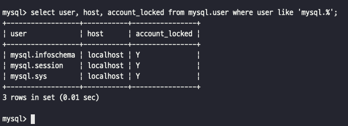

# 이강욱\_2024_11_04_dil.md

- MySQL의 사용자 계정은 단순히 사용자의 아이디 뿐만 아니라 해당 사용자가 어느 IP에서 접속하고 있는지도 확인한다.
- 8.0 버전부터는 권한을 묶어서 관리하는 역할의 개념이 도입됨.

> - 이번주에 책을 꼼꼼하게 읽지 못한 것 같아서 1-3장 중에서 제일 궁금했던 부분인 사용자와 권한에 대해서는 조금 꼼꼼하게 읽어보았다.
> - 처음 알게된 개념들이 생각보다 많았던 것 같지만 모르고 사용했던 부분을 이제는 조금 이해하고 사용하는 것 같아서 뿌듯한 것 같다.

## 3.1) 사용자의 식별

### 사용자의 계정 + 사용자의 접속 지점 (호스트)

- MySQL에서 사용자는 다른 DBMS와는 다르게 사용자의 계정 뿐만 아니라 사용자의 접속 지점도 계정의 일부가 됨 -> 계정 언급시에는 아이디와 호스트를 함께 명시해야 한다.

```sql
'svc_id'@'127.0.0.1'
```

- MySQL 서버가 기동 중인 localhost에서 svc_id라는 아이디로 접속할 때만 사용할 수 있는 계정!

### % 문자 사용

```sql
'svc_id'@'%'
```

- 모든 외부 컴퓨터에서 접속이 가능한 사용자 계정을 생성하고 싶다 -> % 기호 사용!

### 동일한 아이디가 있을 때?

```sql
'svc_id'@'192.168.0.10' (PW: 123)
'svc_id'@'%' (PW: abc)
```

- **IP주소가 192.168.0.10인 PC에서 MySQL 서버에 접속할 때 어떤 인증 정보를 가지고 인증을 실행할 것인지?**
- `범위가 가장 먼저 작은 것을 선택한다.`
- 위에서 범위가 좁은(작은) 것은 %가 포함되지 않은 특정 IP일 것이다 (첫 번째 예시)
- 그래서 비밀번호를 abc로 해서 접속을 하면 안될 것이다.

## 3.2) 사용자 계정 관리

### 3.2.1) 시스템 계정과 일반 계정

- MySQL 8.0부터 계정은 `SYSTEM_USER` 권한을 가지고 있는지에 따라 `시스템 계정`과 `일반 계정`으로 구분이 된다.
  - `시스템 계정`: 데이터베이스 서버 관리자를 위한 계정
  - `일반 계정`: 응용 프로그램이나 개발자를 위한 계정
- 내장된 계정 (삭제X)
  - 'root'@'localhost' --- 제외
  - `'mysql.sys'@'localhost'`: 8.0부터 기본으로 내장된 sys 스키마의 객체(뷰나 함수, 그리고 프로시저)들의 DEFINER로 사용되는 계정
  - `'mysql.session'@'localhost'`: MySQL 플러그인이 서버로 접근할 때 사용되는 계정
  - `'mysql.infoschema'@'localhost'`: information_schema에 정의된 뷰의 DEFINER로 사용되는 계정
  - 
  - account_locked 컬럼을 보면 잠겨있는 상태임.

### 3.2.2) 계정 생성

- 5.7버전까지는 GRANT 명령어로 권한의 부여와 동시에 계정 생성이 가능했음.
- 하지만 8.0버전부터는 계정의 생성은 CREATE USER, 권한 부여는 GRANT로 분리했음.
  - 계정의 인증 방식과 비밀번호
  - 비밀번호 관련 옵션(유효 기간, 비밀번호 이력 개수, 비밀번호 재사용 불가 기간)
  - 기본 역할, SSL 옵션, 계정 잠금 여부

```sql
CREATE USER 'user'@'%'
  IDENTIFIED WITH 'mysql_native_password' BY 'password'
  REQUIRE NONE
  PASSWORD EXPIRE INTERVAL 30 DAY
  ACCOUNT UNLOCK
  PASSWORD HISTORY DEFAULT
  PASSWORD REUSE INTERVAL DEFAULT
  PASSWORD REQUIRE CURRENT DEFAULT
```

#### (1) IDENTIFIED WITH

> 사용자의 인증 방식과 비밀번호를 설정하는 명령문!

- 기본 인증 방식: `IDENTIFIED 'password'`
- MySQL 서버에서는 다양한 인증 방식을 `플러그인` 형태로 제공
- `Native Pluggable Authentication`
  - 5.7버전까지는 기본으로 사용되던 방식
  - **단순 비밀번호에 대한 해시(SHA-1 알고리즘)값을 저장해두고, 클라이언트가 보낸 값과 해시 값이 일치하는지 비교하는 인증 방식**
- `Caching SHA-2 Pluggable Authentication`
  - 암호화 해시값 생성을 위해 SHA-2(256비트) 알고리즘을 사용
  - 위의 플러그인과 가장 큰 차이점?
    - 사용되는 암호화 해시 알고리즘의 차이
    - SHA-2 Authentication은 저장된 해시값의 보안에 더 중점을 둠
    - **Native authentication은 입력이 동일 해시값을 출력하지만 Caching SHA-2는 내부적으로 Salt 키를 사용하며 수천 번의 해시 계산을 수행해서 결과를 만들어 내기 때문에 동일한 키 값에 대해서도 결과가 달라진다.**
    - **해시값을 계산하는 방식은 시간 소모적이어서 성능감소 -> MySQL 서버에서는 해시 결과값을 메모리에 캐시해서 사용한다.**
  - 해당 인증방식을 사용하기 위해서는 SSL/TLS 또는 RSA 키페어를 반드시 사용.
    - 클라이언트에서 접속할 때 SSL 옵션을 활성화 해야한다.
- `PAM Pluggable Authentication`
  - 유닉스나 리눅스 패스워드 또는 LDAP 같은 외부 인증을 사용할 수 있게 해주는 인증 방식.
  - MySQL 엔터프라이즈 에디션에서만 사용 가능.
- `LDAP Pluggable Authentication`
  - LDAP: Lightweight Directory Access Protocol
  - 마찬가지로 엔터페라이즈 에디션에서만 사용 가능.
- **5.7버전에서는 Native가 기본이었지만 8.0에서는 Caching 인증이 기본으로 바뀌었다.**
  - SSL/TLS 또는 RSA 키페어를 사용해야함.
  - **그래서 보안 수준이 낮아진다는데 왜?**

> 참고) **Caching SHA-2 Pluggable Authentication -> SCRAM 방식**
>
> - 평문 비밀번호를 이용해서 5000번 이상 암호화 해시 함수를 실행해야 MySQL 서버로 로그인 요청을 보낼 수 있기 때문에 비밀번호를 입력하는 무차별 대입 공격을 어렵게 만듬.
> - 하지만 악의가 없는 유저 또는 응용 프로그램의 연결이 늦어짐.
> - 그리고 응용 프로그램에서 한번에 많은 컨넥션을 연결하는 경우에는 여전히 응용 프로그램 서버의 CPU 자원을 많이 소모하게 된다는 것?
> - `caching_sha2_password_digest_rounds` 시스템 변수로 설정 가능.
> - 기본 설정값은 5000이고, 최소 설정 가능한 값도 5000이다.

#### (2) REQUIRE

- MySQL 서버에 접속할 때 암호화된 SSL/TLS 채널을 사용할지 여부 결정.
- 설정 안하면 비암호화 채널로 연결.
- 하지만 REQUIRE 옵션을 SSL로 설정하지 않아도 Caching 인증 방식을 사용하면 암호화된 채널만으로 접속할 수 있음.

#### (3) PASSWORD EXPIRE

- 비밀번호 유효기간 설정
- 기본값: `default_password_lifetime` 시스템 변수 참조
- 개발자/데이터베이스 관리자의 비밀번호는 유효기간을 설정하는 것이 보안상 좋지만, 응용 프로그램 접속용 계정에 유효기간을 설정하는 것은 위험하다 (왜?)
  - 비밀번호 유효기간이 만료되면서 CONNECTION이 끊겨서 그러는지?

#### (4) PASSWORD HISTORY

- 한 번 사용했던 비밀번호를 재사용하지 못하게 설정하는 옵션
- `mysql.password_history`를 참고한다.
- 근데 왜 나는 EMPTY?

```sql
SELECT * FROM mysql.password_history;
```

#### (5) PASSWORD REUSE INTERVAL

- 한번 사용했던 비밀번호의 재사용 금지 기간을 설정하는 옵션

#### (6) PASSWORD REQUIRE

- 비밀번호가 만료되어 새로운 비밀번호를 변경할 때 현재 비밀번호를 필요로 할지 말지를 결정하는 옵션

#### (7) ACCOUNT LOCK / UNLOCK

- 계정 생성시 또는 ALTER USER 명령을 사용해서 계정 정보를 변경할 때 계정을 사용하지 못하게 잠글지 여부 설정.

## 3.3) 비밀번호 관리

### 3.3.1) 고수준 비밀번호

> 비밀번호를 쉽게 유추할 수 있는 단어들이 사용되지 않게 글자의 조합을 강제하거나 금칙어를 설정하는 기능을 제공함.

- `validate_password` 컴포넌트 (5.7: 플러그인 / 8.0: 컴포넌트)
- 비밀번호 정책
  - LOW: 비밀번호 길이만 검증
  - MEDIUM: 비밀번호 길이 검증 + 숫자,대소문자,특수문자 배합검증
  - STRONG: MEDIUM + 금칙어 포함 여부 확인
- 검증할 때는 `validate_password`의 시스템 변수를 참고해서 검증
- 금칙어는 직접 만들어도 되지만 배포되어 있는 파일을 가져와서 MySQL 서버에 금칙어 파일을 등록하면 된다.

### 3.3.2) 이중 비밀번호

- 한번 비밀번호를 설정하면 변경하기 어려움.
- **8.0부터는 계정의 비밀번호로 2개의 값을 동시에 사용할 수 있는 기능이 추가.**
- `이중 비밀번호`: **2개의 비밀번호 중 하나만 일치하면 통과되는 것.**

```sql
-- 비밀번호 기본 설정
ALTER USER 'root'@'localhost' IDENTIFIED BY 'old_password';

-- 신규 비밀번호 설정 + 이전 비밀번호를 세컨더리로 설정
ALTER USER 'root'@'localhost' IDENTIFIED BY 'new_password' RETAIN CURRENT PASSWORD;
```

- 이후에 응용 프로그램의 소스코드 또는 설정 파일을 new_password로 변경하고 순차적으로 배포함.
- 완료되면 old_password(세컨더리)는 보안상 삭제하는 것이 좋다.

## 3.4) 권한 (Privilege)

- 5.7버전까지 권한은 글로벌 권한 + 객체 단위의 권한
  - `글로벌 권한`: 데이터베이스나 테이블 이외의 객체에 적용되는 권한
  - `객체 권한`: 데이터베이스나 테이블을 제어하는데 필요한 권한
- 8.0부터는 동적 권한이 추가되었다.
  - `동적 권한`: MySQL 서버가 시작되면서 동적으로 생성하는 권한
    - ex) MySQL 서버의 컴포넌트나 플러그인이 설치되면 그때 등록되는 권한

## 3.5) 역할 (Role)

8.0버전부터 권한을 묶어서 역할(Role)을 사용할 수 있게 되었음.

```sql
CREATE ROLE role_emp_read, role_emp_write;
```

이후 GRANT 명령어를 통해 각 역할에 대해 권한 부여를 하면 된다.

```sql
GRANT SELECT ON employees.* TO role_emp_read;
GRANT INSERT, UPDATE, DELETE ON employees.* TO role_emp_write;
```

그리고 reader와 writer를 생성해보고 역할을 부여해보자.

```sql
CREATE USER 'reader'@'127.0.0.1' IDENTIFIED BY 'qwerty';
CREATE USER 'writer'@'127.0.0.1' IDENTIFIED BY 'qwerty';

GRANT role_emp_read TO 'reader'@'127.0.0.1';
GRANT role_emp_read, role_emp_write TO 'writer'@'127.0.0.1';
```

여기까지 해도, 계정의 활성화된 역할을 조회해보면 없다고 조회된다.
그래서 `SET ROLE` 명령어를 수행해야 한다.

```sql
SET ROLE 'role_emp_read';
```

수동으로 하면 불편하기 때문에 사용자가 MySQL 서버에 로그인할 때 역할을 자동으로 활성화 할지는 `activate_all_roles_on_login` 시스템 변수로 설정할 수 있다.

```sql
SET GLOBAL activate_all_roles_on_login = ON;
```

## 추가 개념 정리

- MySQL 서버의 역할은 사용자 계정과 거의 같은 모습을하고 있고, 서버 내부적으로 역할과 계정은 동일한 객체로 취급된다.

```sql
SELECT user, host, account_locked FROM mysql.user;

- role_emp_read / % / Y
- role_emp_write / % / Y
- reader / 127.0.0.1 / N
- writer / 127.0.0.1 / N
```

- 위와 같이 권한과 계정이 공존한다.
- 하나의 계정에 다른 계정의 권한을 병합하기만 하면 되기 때문에 MySQL 서버는 역할과 계정을 구분할 필요는 없는 것이다.

- 역할을 생성할 때는 host 부분을 붙이지 않았다. 이것은 '%'가 생략된 것이다.
