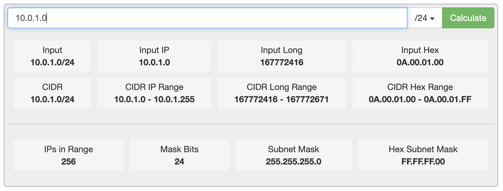

**~ 3장, 59p**

생각보다 생소한 내용이 많은 파트였습니다. <br>
전쳊거으로 간단한 실습이나 공식문서를 참조하면서 공부하는 방식 덕분에, <br>
기존에 도서에 안내된 내용보다 많은 부분을 알게 되었습니다.

1. MySQL 서버의 계정은 `'ID'@'HOST IP'`의 형태로 구성되어 있다.
2. `HOST IP`에는 일반적인 IP, localhost, 그리고 CIDR Block 모두가 가능하다.
3. MySQL 서버의 계정은 시스템 계정과 일반 계정이 있으며 그 세부적인 특성이 다르다.

# 3. 사용자 및 권한 (53~75p)

## 3.1. 사용자 식별 (53~54p)

MySQL의 사용자 계정은 `아이디`와 `호스트 IP`로 구성됩니다.

> RealMySQL 도서에서는 1~2p 분량의 내용이었지만, <br>
> 개인적으로 그 중요도에 비해서 설명이 적다고 생각해서 추가로 레퍼런스 탐색했습니다. 😊
>
> - [3.1.1. 사용자 식별의 기본 규칙](./2024_11_02_dil.md#311-사용자-식별의-기본-규칙)
> - [3.1.2. 사용 중인 사용자 계정 정보 확인하기](./2024_11_02_dil.md#312-사용-중인-사용자-계정-정보-확인하기)
> - [3.1.3. 사용자 식별에 대한 시나리오 테스트](./2024_11_02_dil.md#313-사용자-식별에-대한-시나리오-테스트)
> - [3.1.4. 루프백 인터페이스에 대한 시나리오 테스트](./2024_11_02_dil.md#314-루프백-인터페이스에-대한-시나리오-테스트)
> - [3.1.5. 사용자 계정 정보의 CIDR Block 활용](./2024_11_02_dil.md#315-사용자-계정-정보의-cidr-block-활용) <br><br>

### 3.1.1. 사용자 식별의 기본 규칙

이러한 사용자 계정은 몇 가지 규칙이 적용됩니다.

1. 따옴표(`'`)는 선택값이며 유효하지 않은 문자열에만 사용합니다.

```shell
# SUCCESS
svc_id@127.0.0.1
'svc-id'@127.0.0.1
svc_id@'%'
svc_id@'me'

# FAILURE
svc-id@127.0.0.1 # 아이디에 하이픈(-)이 들어가면 따옴표를 써야 합니다.
svc_id@%         # 호스트 IP에 IP를 제외한 글자는 따옴표를 써야 합니다.
```

2. 호스트 IP(`127.0.0.1`)는 선택값이며 생략할 경우 `%`가 할당됩니다.
3. 호스트 IP(`me`)는 `%`와 동일한 의미를 가집니다.
4. 따옴표(`'`) 대신에 백틱(\`), 쌍따옴표(`"`) 등을 사용할 수 있습니다.

### 3.1.2. 사용 중인 사용자 계정 정보 확인하기

실제로 brew로 설치한 MySQL 서버의 루트 계정 정보를 아래와 같이 확인하였습니다.

```sql
mysql> SELECT CURRENT_USER();
+----------------+
| CURRENT_USER() |
+----------------+
| root@localhost |
+----------------+
1 row in set (0.00 sec)
```

### 3.1.3. 사용자 식별에 대한 시나리오 테스트

따라서 MySQL 클라이언트 연결 시, <br>
아래의 4가지 상황을 예상(`expect`)하였으나 그 중 2가지는 오답(`⛳️`)이었습니다.

```shell
mysql -u root              # expect:성공, result:성공
mysql -u root@'localhost'  # expect:성공, result:실패 ⛳️
mysql -u root@127.0.0.1    # expect:성공, result:실패 ⛳️
mysql -u root@'hello'      # epxect:실패, result:실패
```

리서치 한 결과 MySQL 클라이언트의 호스트 정보는 `-h HOST`의 옵션을 통해서 부여함을 알았습니다. <br>
이후 5가지 상황을 예상(`expect`)하였으나 그 중 3가지는 오답(`⛳️`)이었습니다.

```shell
mysql -u root                # expect:실패, result:성공 ⛳️
mysql -u root -h localhost   # expect:실패, result:성공 ⛳️
mysql -u root -h 'localhost' # epxect:성공, result:성공
mysql -u root -h 127.0.0.1   # epxect:실패, result:성공 ⛳️
mysql -u root -h hello       # expect:실패, result:실패
```

결국 사용자 설정의 네이밍 규칙들은 MySQL 서버에 기록되는 상태의 규칙이었음을 알았습니다. <br>
또한 -h 옵션에 대한 설명을 공식 문서에서 찾을 수 있었습니다. - [Ref [1] 6.2.4 Connecting to the MySQL Server Using Command Options](https://dev.mysql.com/doc/refman/8.0/en/connecting.html)

1. -h 을 할당하지 않을 경우 기본값은 localhost로 할당된다. -
   > The default host name is localhost. On Unix, this has a special meaning, as described later.
2. -h 에서 `127.0.0.1`과 `localhost`는 동일한 단어로 인식된다.
   > To ensure that the client makes a TCP/IP connection to the local server, use --host or -h to specify a host name value of 127.0.0.1 (instead of localhost), or the IP address or name of the local server. You can also specify the transport protocol explicitly, even for localhost, by using the --protocol=TCP option. Examples:

이와 관련하여 더 정확한 개념은 <br>
127.0.0.1 및 ::1은 기본적으로 localhost에 대한 루프백 인터페이스로 사용된다는 점입니다. - [Ref [2] 8.2.4 Specifying Account Names](https://dev.mysql.com/doc/refman/8.0/en/account-names.html)

1. 사용자 PC 내부에서 포트 기반의 사설 네트워크망 사용을 위해서 `루프백 인터페이스` 개념을 사용합니다.
2. IPv4 루프백 인터페이스는 `127.0.0.1`이며, IPv6의 루프백 인터페이스는 `::1`입니다.
3. `cat /etc/hosts | grep 'localhost'`를 이용해서 루프백 인터페이스 내용을 확인할 수 있습니다.

> A host value can be a host name or an IP address (IPv4 or IPv6). The name 'localhost' indicates the local host. The IP address '127.0.0.1' indicates the IPv4 loopback interface. The IP address '::1' indicates the IPv6 loopback interface.

### 3.1.4. 루프백 인터페이스에 대한 시나리오 테스트

[3.1.3. 사용자 식별에 대한 시나리오 테스트](./2024_11_02_dil.md#313-사용자-식별에-대한-시나리오-테스트)에서 <br>
기본적으로 localhost는 IPv4 혹은 IPv6의 루프백 인터페이스 주소를 가짐을 알게 되었습니다.

하지만 왜 기본값이 IPv4인지는 의문입니다.

```shell
mysql -u root -h 127.0.0.1  # expect:성공, result:성공
mysql -u root -h ::1        # expect:성공, result:실패
```

### 3.1.5. 사용자 계정 정보의 CIDR Block 활용

추가적으로 충격적인 부분은 `호스트 IP`에 일반적인 IPv4가 아니라 IPv4 의 CIDR Block을 사용할 수 있다는 점이었습니다. <br>
이를 사용하면 `호스트 IP` 칸엔 10.0.1.0/24을 입력하여 10.0.1.0 ~ 10.0.1.255의 IP의 공용 계정을 만들 수 있습니다.



실제로 웹 서버에서도 활용할 수 있는지 모르겠지만, <br>
MySQL 서버에서 특정한 서버(`EC2 Instance`)가 속하는 특정한 서브넷(`Subnet`)의 대역폭만 여는 식으로 작업이 가능해 보입니다.

> _어디까지나 가설 혹은 상상일뿐, 실제로는 PoC를 진행해보어야 합니다._

## 3.2. 사용자 계정 관리 (54~59p)

### 3.2.1. 시스템 게정과 일반 계정(54~55p)

MySQL 8.0 부터 계정은 SYSTEM_USER 권한을 가지는지에 따라서 2가지로 구분됩니다.

1. 시스템 계정(System Account)
2. 일반 계정(Regular Account)

이와 관련해 몇가지 특징이 추가로 존재합니다.

1. 시스템 계정은 일반 계정을 관리할 수 있다.
2. 일반 계정은 시스템 계정을 관리할 수 없다.
3. 시스템 계정으로만 할 수 있는 몇가지 작업들이 존재한다
4. 계정 관리(계정 생성 및 삭제, 그리고 계정의 권한 부여 및 제거)
5. 다른 세션(Connection) 또는 그 세션에서 실행 중인 쿼리를 강제 종료
6. 스토어드 프로그램 생성 시 DEFINER를 타 사용자로 지정

추가로 RealMySQL에서는 계정과 그 권한을 조회하는 쿼리가 없어 이 DIL에 추가하였습니다.

```sql
SELECT    grantee, privilege_type
FROM      information_schema.user_privileges;

SELECT    grantee, GROUP_CONCAT(privilege_type ORDER BY privilege_type ASC) AS privileges
FROM      information_schema.user_privileges
GROUP BY  grantee;
```

실제로 계정 리스트는 mysql.user 테이블에서도 확인할 수 있는데, <br>
해당 테이블에 어떤 칼럼들이 있는지는 information_schema.columns 에서 찾을 수 있습니다.

```sql
SELECT column_name
FROM information_schema.columns
WHERE table_schema = 'mysql'
  AND table_name = 'user';
```

이후 원하는 칼럼들을 특정하여 MySQL 서버의 전체 계정 리스트를 조회하였습니다.

```sql
mysql> SELECT user, host, account_locked FROM mysql.user;
+------------------+-----------+----------------+
| user             | host      | account_locked |
+------------------+-----------+----------------+
| mysql.infoschema | localhost | Y              |
| mysql.session    | localhost | Y              |
| mysql.sys        | localhost | Y              |
| root             | localhost | N              |
+------------------+-----------+----------------+
```

### 3.2.2. 계정 생성 (55~59p)

MySQL 5.7 버전까지는 `GRANT` 명령어로 권한의 부여와 계정 생성이 가능했습니다.
MySQL 8.0 버전부터는 `CREATE USER` 명령어로 계정 생성을 `GRANT` 명령어로 권한 부여를 해야 합니다.

```sql
mysql> CREATE USER 'user'@'%'
        IDENTIFIED WITH 'mysql_native_password' BY 'password'
        REQUIRE NONE
        PASSWORD EXPIRE INTERVAL 30 DAY
        ACCOUNT UNLOCK
        PASSWORD HISTORY DEFAULT
        PASSWORD REUSE INTERVAL DEFAULT
        PASSWORD REQUIRE CURRENT DEFAULT;
```

| 옵션                    | 설명                                                                                                                                                                                                                                                                                  |
| ----------------------- | ------------------------------------------------------------------------------------------------------------------------------------------------------------------------------------------------------------------------------------------------------------------------------------- |
| IDENTIFIED WITH         | - `Native Pluggable Authentication(MySQL 5.7)` <br>- `Cache SHA-256 Pluggable Authentication(MySQL 8.0~)` <br> - PAM Pluggable Authentication(MySQL Enterprise) <br> - LDAP Pluggable Authetnication(MySQL Enterprise)                                                                |
| REQUIRE                 | - MySQL 서버 접속시 SSL/TLS 채널을 사용할지 여보                                                                                                                                                                                                                                      |
| PASSWORD EXPIRE         | - `PASSWORD EXPIRE` : 계정 생성과 동시에 비밀번호 만료 처리 <br> - `PASSWORD EXPIRE NEVER` : 계정 비밀번호의 만료 기한 없음 <br> - `PASSWORD EXPIRE DEFAULT` : default_password_lifetime 시스템 변수의 기간으로 만료 <br> - `PASSWORD EXPIRE INTERVAL n DAY` : n일 이후 만료          |
| PASSWORD HISTORY        | - `PASSWORD HISTORY DEFULT` : 히스토리에 저장된 비밀번호를 모두 사용하지 못함 <br> - `PASSWORD HISTORY n` : n개까지 히스토리 저장                                                                                                                                                     |
| PASSWORD REUSE INTERVAL | - `PASSWORD REUSE INTERVAL DEFAULT` : password_reuse_interval 변수의 기간으로 설정 <br> - `PASSWORD REUSE INTERVAL n day` : n일자 이후에 비밀번호를 재사용할 수 있게 설정                                                                                                             |
| PASSWORD REQUIRE        | - `PASSWORD REQUIRE CURRENT` : 비밀번호를 변경할 때 현재 비밀번호를 먼저 입력하도록 설정 <br> - `PASSWORD REQUIRE OPTIONAL` : 비밀번호를 입력할 때 현재 비밀번호를 입력하지 않아도 되도록 설정 <br> - `PASSWORD REQUIRE DEFAULT` : password_require_current 시스템 변수의 값으로 설정 |
| ACCOUNT LOCK/UNLOCK     | - `ACCOUNT LOCK` : 계정을 사용하지 못하게 잠금 <br> - `ACCOUNT UNLOCK` : 잠긴 계정을 다시 사용 가능 상태로 잠금 해제                                                                                                                                                                  |

## 3.3. 비밀번호 관리 (60~64p)

## 3.4. 권한 (64~70p)

## 3.5. 역할 (70~75p)
