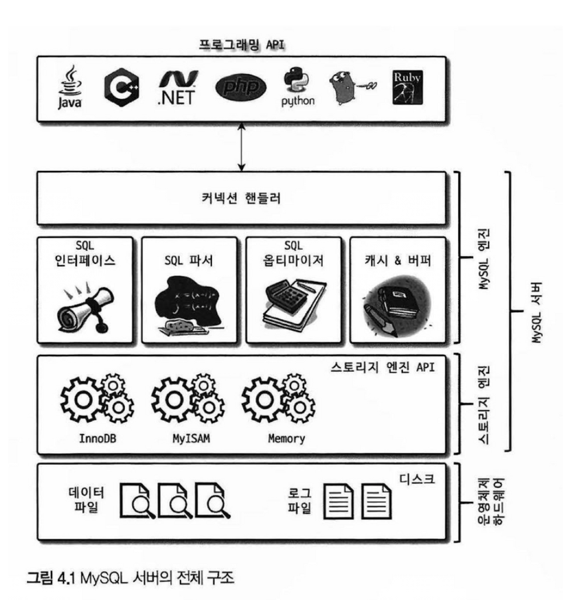

**~ 4장, ~97p**

전체적으로 1~3 장보다 훨씬 더 추상적인 내용들이 많았습니다. <br>
실제로 이런 내용을 기반으로 **어떤 것을 신경** 쓰고 **어떤 것을 조심** 해야 하는지 잘 모르겠습니다. <br>
자세한 내용은 후술 할 것이라고 생각하면서 읽어 내려갔습니다.

1. MySQL은 `MySQL Engine`과 `Storage Engine`으로 구성되어 있으며, 그 사이에 `Handler API`를 사용한다.
2. MySQL은 멀티 스레딩 환경에서 작동되며 이에 따라 `공유 메모리(for 글로벌 메모리)`와 `독립 메모리(for 로컬 메모리)` 공간을 사용한다.
3. MySQL의 쿼리 실행 과정은 `쿼리 파서`, `전처리기`, `옵티마이저`, `쿼리 실행기`로 구성되며, `옵티마이저`가 그 성능 상 핵심을 차지한다.
4. MySQL의 가용성을 유지하기 위해 Replication, Trasaction supported Metadata 등의 간단한 개념이 존재한다.

# 4. MySQL 아키텍처 (77~97p)

MySQL은 크게 `MySQL Engine`과 `Storage Engine`으로 구성 되어 있습니다. <br>

# 4.1. MySQL Engine에 대해서 (77~97p)

MySQL Engine을 부분을 다음과 같이 11개 부분으로 구분하여 학습하였습니다.

1. Handler API (79p)
2. MySQL Threading Model (81~83p)
3. 메모리 할당 및 사용 구조 (84~85p)
4. Storage Engine (86~89p)
5. Plugin (88p)
6. Component (89~90p)
7. 쿼리 실행 구조 (91~92p)
8. Replication (92p)
9. Query Cache (93p)
10. Thread Pool (93~95p)
11. Transaction supported Metadata (95~97p)



## 4.1. Handler API (79p)

MySQL Engine의 쿼리 실행기에서 **데이터를 쓰거나 읽어야 할 때** <br>
MySQL Engine이 각 `Storage Engine`에 `Handler API`를 통해서 요청을 보냅니다.

아래 명령어를 통해서 <br>
각 `Handler API`에 얼마나 많은 데이터(레코드) 작업이 있는지 확인이 가능합니다.

```sql
SHOW GLOBAL STATUS LIKE 'Handler%';

+----------------------------+-------+
| Variable_name              | Value |
+----------------------------+-------+
| Handler_commit             | 575   |
...
| Handler_write              | 8     |
+----------------------------+-------+
18 rows in set (0.01 sec)
```

## 4.2. MySQL Threading Model (81~83p)

MySQL 서버는 스레드 기반으로 작동하며 `Foreground`, `Background`로 구분되어 있습니다. <br>

`MySQL Engine`, `Storage Engine` 등에서 사용되는 다양한 스레드들을 볼 수 있습니다.

```sql
SELECT thread_id, name, type, processlist_user, processlist_host
FROM performance_schema.threads ORDER BY type, thread_id;

+-----------+---------------------------------------------+------------+------------------+------------------+
| thread_id | name                                        | type       | processlist_user | processlist_host |
+-----------+---------------------------------------------+------------+------------------+------------------+
|         1 | thread/sql/main                             | BACKGROUND | NULL             | NULL             |
...
|        46 | thread/mysqlx/acceptor_network              | BACKGROUND | NULL             | NULL             |
|        43 | thread/sql/event_scheduler                  | FOREGROUND | event_scheduler  | localhost        |
|        47 | thread/sql/compress_gtid_table              | FOREGROUND | NULL             | NULL             |
|        49 | thread/sql/one_connection                   | FOREGROUND | root             | localhost        |
+-----------+---------------------------------------------+------------+------------------+------------------+
```

> **버퍼링(Buffering)에 대한 기념?** <br>
> 대부분의 상용 DB에는 쓰기 작업을 `버퍼링(Buffering)`해서 일괄로 쓰는 `플러싱(Flushing)`하는 과정이 있습니다. <br>
> InnoDB는 이러한 쓰기 버퍼링 기능을 사용하지만, MyISAM은 쓰기 버퍼링 기능을 지원하지 않습니다. <br>
> -> 기본적으로 Disk 부하량이 높을 것 같다고 생각하는데 왜 MyISAM을 쓸까요?

## 4.3. 메모리 할당 및 사용 구조 (84~85p)

MySQL에서 사용되는 메모리 영역은 `글로벌 메모리`와 `롴러 메모리` 영역으로 구분됩니다.

- 글로벌 메모리 영역
  - 클라이언트 스레드 수와 무관하게 하나의 메모리 공간만 할당
  - 필요에 따라 N 개의 메모리 공간이 생겨도 모든 스레드가 공유
  - `테이블 캐시`, `InnoDB 버퍼풀`, `InnoDB 어댑티브 해시 인덱스`, `InnoDB 리두 로그 버퍼`
- 로컬 메모리 영역
  - 클라이언트 스레드가 쿼리를 처리하는데 사용되는 영역
  - 각 클라이언트 스레드가 반드시 **독립적**으로 해당 영역을 사용
  - `커넥션 버퍼`, `결과 버퍼`, `정렬 버퍼`, `조인 버퍼`, `바이너리 로그 캐시`, `네트워크 버퍼`
    - 커넥션이 열려있는 동안 계속 할당되는 공간 : 커넥셩 버퍼, 결과 버퍼
    - 쿼리를 실행하는 순강네만 열리는 공간 : 정렬 버퍼, 조인 버퍼

## 4.4. Storage Engine (86~89p)

MySQL은 실제 데이터의 읽기/쓰기를 `Storage Engine`에 위임한다. <br>
MySQL은 읽기/쓰기 위임을 위해서 [Handler API](./2024_11_10_dil.md#41-handler-api-79p)를 사용합니다. <br>

그리고 이런 Storage Engine은 다음 쿼리로 조회할 수 있습니다.

```sql
mysql> SHOW ENGINES;
+--------------------+---------+----------------------------------------------------------------+--------------+------+------------+
| Engine             | Support | Comment                                                        | Transactions | XA   | Savepoints |
+--------------------+---------+----------------------------------------------------------------+--------------+------+------------+
| ARCHIVE            | YES     | Archive storage engine                                         | NO           | NO   | NO         |
| BLACKHOLE          | YES     | /dev/null storage engine (anything you write to it disappears) | NO           | NO   | NO         |
| MRG_MYISAM         | YES     | Collection of identical MyISAM tables                          | NO           | NO   | NO         |
| FEDERATED          | NO      | Federated MySQL storage engine                                 | NULL         | NULL | NULL       |
| MyISAM             | YES     | MyISAM storage engine                                          | NO           | NO   | NO         |
| PERFORMANCE_SCHEMA | YES     | Performance Schema                                             | NO           | NO   | NO         |
| InnoDB             | DEFAULT | Supports transactions, row-level locking, and foreign keys     | YES          | YES  | YES        |
| MEMORY             | YES     | Hash based, stored in memory, useful for temporary tables      | NO           | NO   | NO         |
| CSV                | YES     | CSV storage engine                                             | NO           | NO   | NO         |
+--------------------+---------+----------------------------------------------------------------+--------------+------+------------+
9 rows in set (0.00 sec)
```

위 `Storage Engine`이 MySQL 서버(mysqld)에 포함되고 활성화된지 여부에 따라서 4 가지로 구분됩니다.

1. Default : 포함되어 있으며, 기본값으로 활성
2. YES : 포함되어 있으며, 명시적인 선언으로 사용 가능
3. NO : 포함되어 있지 않음
4. Disable : 활성화 되어 있지 않음

여기서 중요한 키워드는 `포함`과 `활성화`입니다. <br>

- 포함
  - 포함되어 있지 않은 스토리지 엔진은 사용할 수 없습니다.
  - 포함 시킨 후에 MySQL 서버를 다시 빌드해야 사용할 수 있습니다.
- 활성화
  - 활성화 되어 있지 않은 데이터베이스는 사용할 수 없습니다.
  - disabled_storage_engines 값에서 해당 DB를 제외해야 합니다.

#### 4.4.1. 포함

위에서 배운 개념대로면 <br>
Default, YES 대상은 선택할 수 있으나, <br>
NO, Disable 대상은 선택할 수 없어야 할 것 같습니다.

실제로 `Disalbe`을 제외한 항목을 다음과 같은 결과를 볼 수 있습니다.

```sql
-- Support=Default
CREATE TABLE test_table_1 (fd1 INT, fd2 INT) ENGINE=InnoDB;
Query OK, 0 rows affected (0.01 sec)

-- Support=YES
CREATE TABLE test_table_2 (fd1 INT, fd2 INT) ENGINE=MyISAM;
Query OK, 0 rows affected (0.00 sec)


-- Support=NO
CREATE TABLE test_table_3 (fd1 INT, fd2 INT) ENGINE=FEDERATED;
ERROR 1286 (42000): Unknown storage engine 'FEDERATED'
```

다만 `Disable` 항목을 테스트하기 위해서 [disable 하는 방법](./2024_11_10_dil.md#442-활성화-리서치)을 시도했으나 성공하지 못했습니다.

#### 4.4.2. 활성화 (리서치)

MySQL에서 사용 불가능한 `Storage Engine`은 다음과 같이 기록되어 있습니다.

```sql
SHOW GLOBAL VARIABLES LIKE 'disabled_storage_engines';
+--------------------------+-------+
| Variable_name            | Value |
+--------------------------+-------+
| disabled_storage_engines |       |
+--------------------------+-------+
1 row in set (0.01 sec)
```

저희는 이미 3장에서 `SET`, `SET PERSIST`, `SET PERSIST_ONLY`를 배웠습니다만, <br>
`disabled_storage_engines` 값은 read_only 값으로서 아래 구문으로 변경할 수 없습니다.

> `SET PERSIST_ONLY`는 쿼리가 성공하지만 실제로 반영은 되지 않습니다.

```sql
SET disabled_storage_engines='MyISAM';
SET PERSIST disabled_storage_engines='MyISAM';
SET PERSIST_ONLY disabled_storage_engines='MyISAM';

SHOW GLOBAL VARIABLES LIKE 'disabled_storage_engines'; -- 여전히 NULL
SHOW ENGINES;                                          -- 여전히 Support가 YES인 것을 알 수 있음
```

StackOverflow에서 MySQL 5.7 버전에서는 my.cnf 파일을 수정한다고 하지만 <br>
해당 방법이 제가 쓰는 MySQL 8.0 버전에서 작동하지 않는데 어떻게 이걸 바꿀 수 있을까요? - [Ref - StackOverflow](https://stackoverflow.com/questions/30185513/disable-myisam-engine-in-mysql)

### 4.5. Plugin (88p)

MySQL에서 Plugin 명단도 다음 쿼리로 조회할 수 있습니다. - [Ref](https://dev.mysql.com/doc/refman/8.4/en/show-plugins.html)

```sql
mysql> SHOW PLUGINS; -- SHOW PLUGINS\G;
+---------------------------------+----------+--------------------+---------+---------+
| Name                            | Status   | Type               | Library | License |
+---------------------------------+----------+--------------------+---------+---------+
| binlog                          | ACTIVE   | STORAGE ENGINE     | NULL    | GPL     |
...
| mysqlx                          | ACTIVE   | DAEMON             | NULL    | GPL     |
+---------------------------------+----------+--------------------+---------+---------+
45 rows in set (0.00 sec)
```

> **Plugin의 제약사항**
> 1. Plugin은 오직 MySQL 서버와 인터페이스할 수 있고, 플러그인끼리 통신할 수 없음
> 2. Plugin은 MySQL 서버의 변수나 함수를 직접 호출하기 때문에 안전하지 않음 (캡슐화 안함)
> 3. Plugin은 상호 의존 관계를 설정할 수 없어서 초기화가 어려움 <br><br> 

### 4.6. Component (89~90p)

MySQL 8.0에서는 Plugin을 대체할 기능으로서 Component를 추가하였습니다. <br>
아래 쿼리를 통해서 설치된 Component 들을 조회할 수 있습니다.

```sql
SELECT * FROM mysql.component;
```

특히 비밀번호 검증 기능은 Plugin에서 Component로 개선되었습니다.

> 그런데 왜 기본값으로는 Plugin을 썻는지는 미지수입니다.

### 4.7. 쿼리 실행 구조

`MySQL Engine`에서 쿼리는 총 4단계로 실행됩니다.

- 쿼리 파서
  - 쿼리 문장을 토큰 단위로 분리해 MySQL이 이해할 수 있는 트리 형태 구조로 변환
  - 기본적인 문법 에러 감지
- 전처리기
  - 쿼리 문장 및 트리에 구조적인 문제점 확인
  - 각 테이블, 칼럼, 내장 함수와 같은 객체가 있는지 확인
  - 실제로 존재하지 않거나 권한 상 사용할 수 없으면 에러 발생
- 옵티마이저
  - 요청으로 들어온 쿼리 트리를 가장 효율적으로 처리할 수 있도록 결정
- 쿼리 실행기
  - 옵티마이저의 결정 사항을 실제로 실행

### 4.9. Query Cache (93p)

SQL 실행 결과를 캐시하던 기능 MySQL 8.0에서 제거됨

### 4.10. Thread Pool (93~95p)

MySQL Community 버전은 Thread Pool 버전을 사용하지 않아서 따로 리서치하지 않음

### 4.11. Transaction supported Metadata (95~97p)

데이터베이스에서 메타데이터는 테이블 딕셔너리로도 부릅니다. <br>
이 정보는 테이블의 구조 정보와 스토어드 프로그램 등의 정보를 기록하빈다.

MySQL 5.7에서는 테이블 구조를 FRM 파일에 저장하고 스토어드 프로그램도 *.(TRN|TRG|PAR,...) 파일에 저장하였으나 <br>
이 방식은 트랜잭션을 지원하지 않아서 시스템 장애 시의 `테이블 생성 및 변경` 작업에 대한 트랜잭션이 보장되지 않습니다.

따라서

MySQL 8.0부터는 메타데이터를 InnoDB를 이용해서 처리하녀 트랜잭션을 보장하게 변경하였습니다. <br>
이 안에는 [시스템 테이블 스페이스](https://dev.mysql.com/doc/refman/8.0/en/innodb-system-tablespace.html)와 [데이터 딕셔너리](https://dev.mysql.com/doc/refman/8.0/en/data-dictionary.html) 등의 정보는 모두 모아서 `mysql.idb`파일에 저장됩니다.

아래 쿼리를 통해서 `mysql.idb` 파일 위치 및 정보를 확인할 수 있습니다.

```sql
-- 경로 보기
SHOW GLOBAL VARIABLES LIKE 'innodb_data_home_dir';
+----------------------+-------+
| Variable_name        | Value |
+----------------------+-------+
| innodb_data_home_dir |       |
+----------------------+-------+
1 row in set (0.01 sec)

-- 파일 보기
SHOW GLOBAL VARIABLES LIKE 'innodb_data_file_path';
+-----------------------+------------------------+
| Variable_name         | Value                  |
+-----------------------+------------------------+
| innodb_data_file_path | ibdata1:12M:autoextend |
+-----------------------+------------------------+
1 row in set (0.00 sec)
```

만약 해당 경로를 찾기 어렵다면 아래의 경로에 있을 수도 있습니다.

```sql
mysql> SHOW VARIABLES LIKE 'datadir';
+---------------+--------------------------+
| Variable_name | Value                    |
+---------------+--------------------------+
| datadir       | /opt/homebrew/var/mysql/ |
+---------------+--------------------------+
1 row in set (0.01 sec)
```

하지만 `cat` 구문으로 해당 테이블 스페이스 파일을 보면 디코딩에 실패한 것을 알 수 있습니다.

```shell
cat /opt/homebrew/var/mysql/mysql.ibd
```

따라서 `idb2sdi`이라는 InnoDB Tablespace SDI 추출 유틸리티를 사용해야 합니다. - [Ref](https://dev.mysql.com/doc/refman/8.0/en/ibd2sdi.html)

```shell
ibd2sdi /opt/homebrew/var/mysql/mysql.ibd
```
