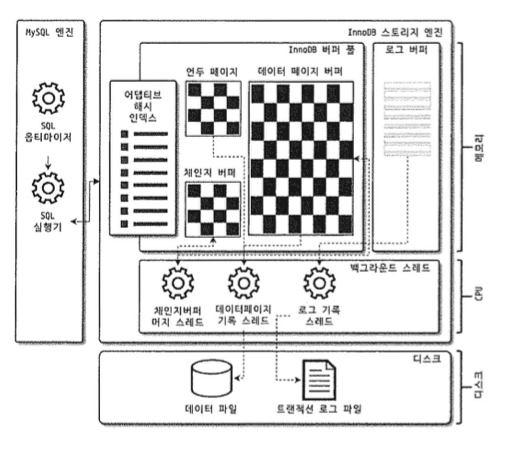
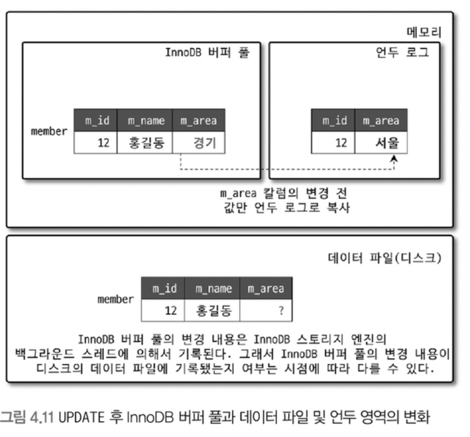

**~ 4장, 137p**

전체적으로 1~4장에 비해서 훨씬 추상적인 내용들이 많았습니다. <br>
대부분의 지식들은 실제로 프로젝트를 진행하며 `튜닝` 과정을 통해서 지식을 함양해야 할 것 같습니다.

1. InnoDB의 PK, FK, 데드락과 관련된 인사이트를 얻을 수 있었습니다.
2. InnoDB 버퍼풀, 체크포인트 에이지 등을 깊게 알게 되어 현업에서 세부 조정을 해보고 싶은 마음이 들었습니다.
3. InnoDB Redo Log, Undo Log에 대한 기본적인 내용을 알 수 있었습니다.

# 4. MySQL 아키텍처 (77~153p)

# 4.1. MySQL Engine에 대해서 (77~97p)

- [2024_11_10_dil](./2024_11_10_dil.md)

# 4.2. InnoDB 스토리지 엔진 아키텍처 (98)



## 4.1. PK에 의한 클러스터링 (99p)

InnoDB의 모든 테이블은 기본적으로 PK에 의해서 클러스터링 되어 저장됩니다. <br>

1. 개발자가 Primary Key를 명시적으로 선언할 수 있습니다.
2. 선언하지 않으면 열이 NOT NULL인 첫 번째 Unique Index가 PK로 할당됩니다.
3. 1,2 가 없는 경우 6 Byte의 숫자가 Cluster Index로서 PK로 자동 할당됩니다.

> **Cluster Index란 말의 의미는 무엇일까?** <br>
> 모든 레코드들은 Primary Key가 유사한 레코드들끼리 묶여서 저장됩니다. <br>
> 따라서 쓰기 성능은 저하되지만 Primary Key 기반의 읽기 성능은 개선됩니다. <br>
> Index로 조회를 할 경우에도 Index, Primary Key 순으로 타고들어가며 읽기 성능이 개선됩니다. - [Ref](https://mangkyu.tistory.com/285)

_(자세하게는 "8.8절-클러스터링 인덱스" 에서 후술하겠지만)_ <br>
모든 `세컨더리 인덱스(Seconary Index)`는 레코드의 주소가 아닌 `PK`를 주소로 합니다. <br>
따라서 세컨더리 인덱스를 참조하는 쿼리보다 PK를 참조하는 범위 스캔이 더 빠르게 처리됩니다.

## 4.2. 외래키 지원 (99p)

1. 외래키는 InnoDB 스토리지 엔진에서 지원되는 기능으로 MyISAM, MEMORY에서는 사용 불가합니다.
2. 외래키는 운영 상의 불편함 때문에 사용하지 않는 경우가 있다.
3. 외래키는 Index Lock 전파와 이로 인한 Dead Lock이 밠애할 수 있다.
4. `foreign_key_checks`를 비활성화 하여 외래키 관계에 의한 체크 작업을 일시적으로 중단할 수 있다.
5. `foreign_key_checks`를 비활성화 하면 `ON DELETE/UPDATE CASCADE` 옵션도 무시된다.
6. 특정 기능에서만 이 옵션을 끄고 싶다면 `SET SESSION foreign_key_checks=OFF`를 사용할 수 있다.

## 4.3. 트랜잭션 격리 레벨(Transaction Isolation Level)

MySQL 8.0에서는 시스템 변수 `transaction_isolation`에 따라서 Transaciton Isolation Levels이 정의됩니다.

> **트랜잭션 격리(Transaction Isolation)은 데이터베이스 처리의 기초 중 하나입니다.** <br>
> 격리 수준은 여러 트랜잭션이 동시에 변경하고 쿼리를 수행할 때의 안정성, 일관성 및 결과의 재현성 간의 균형을 미세 조정합니다. <br>
> ACID 중에서 I를 담당하는 기능이라고 생각할 수 있습니다. - [Ref](https://dev.mysql.com/doc/refman/8.0/en/innodb-transaction-isolation-levels.html)
>
> - Atomicity : 원자성
> - Consistency : 일관성
> - Isolation : 격리성
> - Durability : 지속성

| Option            | Description                                                                                                                    |
| ----------------- | ------------------------------------------------------------------------------------------------------------------------------ |
| `READ_UNCOMMITED` | 트랜잭션이 커밋되지 않은 내용도 읽을 수 있음                                                                                   |
| `READ_COMMITTED`  | 트랜잭션이 커밋된 내용만 읽을 수 있음                                                                                          |
| `REPEATABLE_READ` | 동일한 트랜잭션 내에서 읽은 데이터는 다른 트렌잭션에 의해서 변경되지 않음. <br> Phantom Read를 방지하지만 데이터 삽입은 가능함 |
| `SERIALIZABLE`    | 모든 트랜잭션이 직렬화된 것처럼 처리되어 트랜잭션 간 상호 영향을 미치지 않음                                                   |

### 4.3.1. Phantom Read (리서치 필요)

- Dirty Read, Non-repeatable read : https://engineerinsight.tistory.com/182
- Phantom Read : https://parkmuhyeun.github.io/woowacourse/2023-11-28-Repeatable-Read/

## 4.4. MVCC(Multi Version Concurrency Control) (100~103p)

MySQL 8.0에서는 `MVCC`를 이용해서 다양한 버전이 존재하는 동시성 환경에서 일광성을 보장하려 노력합니다. <br>

만약 다음과 같은 쿼리가 실행이 된다면 유저 '홍길동'의 지역은 '서울'로 나올까 '경기'로 나올까?

```sql
CREATE TABLE member (
    m_id INT NOT NULL,
    m_name VARCHAR(20) NOT NULL,
    m_area VARCHAR(100) NOT NULL,
    PRIMARY KEY (m_id),
    INDEX ix_area (m_area)
);

INSERT INTO member (m_id, m_name, m_area) VALUES (12, '홍길동', '서울');

UPDATE member SET m_area='경기' WHERE m_id=12;

SELECT * FROM member WHERE m_id=12;
```

해당 문제의 정답은 [트랜잭션 격리 수준(Transaction Isolation Level)](./2024_11_11_dil.md#43-트랜잭션-격리-레벨transaction-isolation-level)에 따라서 달라집니다.

InnoDB에서 트랜잭션(Transaction) 작업이 시작되고 커밋 되기 전의 상태일 때는 아래와 같은 상태가 됩니다.



위 그림에서 '경기'라고 써져있는 부분은 아직 커밋(Commit)되지 않은 데이터일 겁니다.
따라서 트랜잭션 격리 레벨이 `READ_UNCOMMITED`인 경우에는 '경기'가 조회되며 그 외의 모든 경우에는 '서울'이 조회될 것입니다.

### 4.4.1. MVCC와 Dirty Read 시나리오 테스트 1 - READ_UNCOMMITTED

MySQL Client를 2개를 실행하고 테스트를 하면 <br>
`READ_UNCOMMITTED` 수준에서 MVCC 쪽에서는 Dirty Read 상태에 빠집니다.

- A Client

```sql
BEGIN;
UPDATE member SET m_area='경기' WHERE m_id=12;
```

- B Client

```sql
SET TRANSACTION ISOLATION LEVEL READ UNCOMMITTED;

SHOW GLOBAL VARIABLES LIKE 'transaction_isolation';

SELECT * FROM member WHERE m_id=12;
+------+-----------+--------+
| m_id | m_name    | m_area |
+------+-----------+--------+
|   12 | 홍길동    | 경기   |
+------+-----------+--------+
1 row in set (0.00 sec)
```

- A Client

```sql
COMMIT;
```

- B Client

```sql
SET TRANSACTION ISOLATION LEVEL READ UNCOMMITTED;

SHOW GLOBAL VARIABLES LIKE 'transaction_isolation';

SELECT * FROM member WHERE m_id=12;
+------+-----------+--------+
| m_id | m_name    | m_area |
+------+-----------+--------+
|   12 | 홍길동    | 경기   |
+------+-----------+--------+
1 row in set (0.00 sec)
```

### 4.4.2. MVCC와 Dirty Read 시나리오 테스트 2 - 그 외

MySQL Client를 2개를 실행하고 테스트를 해도 <br>
`READ_UNCOMMITTED` 수준에서 MVCC 쪽에서는 Dirty Read 상태에 빠지지 않습니다.

- A Client

```sql
BEGIN;
UPDATE member SET m_area='경기' WHERE m_id=12;
```

- B Client

```sql
SET TRANSACTION ISOLATION LEVEL REPEATABLE READ;

SHOW GLOBAL VARIABLES LIKE 'transaction_isolation';

SELECT * FROM member WHERE m_id=12;
+------+-----------+--------+
| m_id | m_name    | m_area |
+------+-----------+--------+
|   12 | 홍길동    | 경기   |
+------+-----------+--------+
1 row in set (0.00 sec)
```

- A Client

```sql
COMMIT;
```

- B Client

```sql
SET TRANSACTION ISOLATION LEVEL REPEATABLE READ;

SHOW GLOBAL VARIABLES LIKE 'transaction_isolation';

SELECT * FROM member WHERE m_id=12;
+------+-----------+--------+
| m_id | m_name    | m_area |
+------+-----------+--------+
|   12 | 홍길동    | 경기   |
+------+-----------+--------+
1 row in set (0.00 sec)
```

## 4.5. 자동 데드락 감지 (104~105p)

InnoDB는 내부적으로 잠금이 교착 상태에 빠지지 않는지 체크하기 위해 <br>
잠금 대기 목록을 그래프(Wait for List) 형태로 관리한다.

InnoDB의 `데드락 감지 스레드`는 주기적으로 잠금 대기 그래프(Wait for List)를 검사하여 <br>
교착 상태에 빠진 트랜잭션 들을 찾아서 그 중 하나를 제거합니다.

> **교착 상태인 트랜잭션 중 어떤 것을 지울것인가?** <br>
> 일반적으로 언두 로그를 가장 적게 가진 트랜잭션이 롤백의 대상이 됩니다.

InnoDB는 MySQL Engine에서 관리하는 테이블 잠금인 `LOCK TABLES`은 인식할 수 없습니다. <br>
따라서 이를 위해서 `innodb_table_locks`옵션을 활성화 해두는 것이 좋습니다.

```sql
mysql> SHOW GLOBAL VARIABLES LIKE 'innodb_table_locks';
+--------------------+-------+
| Variable_name      | Value |
+--------------------+-------+
| innodb_table_locks | ON    |
+--------------------+-------+
1 row in set (0.01 sec)
```

다만 InnoDB에서 동시 처리량이 많아지거나 각 트랜잭션의 잠금의 양이 많다면 <br>
`데드락 감지 스레드`로 인해서 많은 양의 CPU가 소모될 것입니다. <br>
이 경우에는 기본적으로 비활성화하고 timeout을 통하는 것이 좋습니다.

```sql
mysql> SHOW GLOBAL VARIABLES WHERE Variable_name REGEXP '^(innodb_deadlock_detect|innodb_lock_wait_timeout)$';
+--------------------------+-------+
| Variable_name            | Value |
+--------------------------+-------+
| innodb_deadlock_detect   | ON    |
| innodb_lock_wait_timeout | 50    |
+--------------------------+-------+
2 rows in set (0.00 sec)
```

## 4.6. 자동화된 장애 복구 (105~108p)

InnoDB는 손실 및 장애로부터 데이터를 보호하기 위한 여러 가지 매커니즘이 탑재되어 있습니다. <br>
이를 이용해 MySQL 서버가 시작할 때 `완료되지 못한 트랜잭션`이나 `디스크에 일부만 기록된 데이터 페이지` 등에 <br>
대한 일련의 복구 작업이 자동으로 진행됩니다.

하지만 일부 치명적인 문제나 자동 복구가 불가능하면 MySQL 서버가 시작되지 않습니다. <br>
이런 경우에 `innodb_force_recovery` 시스템 변수를 설정해서 MySQL 서버를 시작해야 합니다.

```sql
mysql> SHOW GLOBAL VARIABLES LIKE 'innodb_force_recovery';
+-----------------------+-------+
| Variable_name         | Value |
+-----------------------+-------+
| innodb_force_recovery | 0     |
+-----------------------+-------+
1 row in set (0.01 sec)
```

| Value | Info                         | Description                              |
| ----- | ---------------------------- | ---------------------------------------- |
| 1     | `SRC_FORCE_IGNORE_CORRUPT`   | 데이터 손상을 무시                       |
| 2     | `SRC_FORCE_NO_BACKGROUND`    | 백그라운드 작업 중지 강제                |
| 3     | `SRC_FORCE_NO_TRX_UNDO`      | 트랜잭션 롤백 비활성화                   |
| 4     | `SRC_FORCE_NO_IBUF_MERGE`    | IBUF(Innodb Insert Buffer) 병합 비활성화 |
| 5     | `SRC_FORCE_NO_UNDO_LOG_SCAN` | 언두 로그 스캔 비활성화                  |
| 6     | `SRC_FORCE_NO_LOG_REDO`      | 로그의 리두(Redo) 비활성화               |

## 4.7. InnoDB 버퍼풀(Buffer Pool) (108~120p)

데이터베이스에서 대량의 읽기/쓰기 작업으로 인한 시스템 부하가 발생합니다. <br>
따라서 SELECT, INSERT, UPDATE, DELETE 작업들은 InnoDB 버퍼풀을 활용하며 <br>
디스크 읽기/쓰기를 최소한으로 줄여서 가동합니다.

### 4.7.1. InnoDB 버퍼풀 크기 (108~109p)

시스템 전체의 메모리를 `운영체제`, `MySQL 프로세스`, `InnoDB 버퍼풀`이 나눠사 사용합니다. <br>
따라서 메모리 총량이 변동되지 않는 선에서 운영체제외 MySQL 프로세스를 제외한 부분을 `InnoDB 버퍼풀`에 할당합니다. <br>
통상적으로 정해진 수치가 있는 것은 아니기 때문에 버퍼풀의 크기를 늘리거나 줄이면서 조절해야 할 수 있습니다.

아래 쿼리를 통해서 `@@innodb_buffer_pool_size` 용량을 조회할 수 있습니다.

```sql
mysql> SELECT @@innodb_buffer_pool_size;
+---------------------------+
| @@innodb_buffer_pool_size |
+---------------------------+
|                 134217728 |
+---------------------------+
```

출력된 값은 byte 단위이기 때문에 결괒거으로 128 MB 정도의 `버퍼풀`을 가짐을 알 수 있습니다. <br>
실제 도서에서도 `@@innodb_buffer_pool_size`는 128 MB 단위로 증분된다고 다루고 있습니다.

> - 134,217,728 Byte = 134,217,728 Byte / 1024 Byte/KB = 131,072 KB
> - 131,072 KB / 1024 KB/MB = 128 MB
> - 128 MB / 1024 MB/GB = 0.125 GB

InnoDB에서 단일 버퍼풀을 사용할 때에는 <br>
동시성 처리를 위해서 `세마포어` 등의 개념을 사용하였으나 <br>
이 방식이 `내부 잠금 경합`을 유발하기에 복수의 버퍼풀을 사용할 수 있게 변경되었습니다.

아래 쿼리를 통해서 `@@innodb_buffer_pool_instances`를 확인할 수 있었습니다.

```sql
mysql> SELECT @@innodb_buffer_pool_instances;
+--------------------------------+
| @@innodb_buffer_pool_instances |
+--------------------------------+
|                              1 |
+--------------------------------+
1 row in set (0.00 sec)
```

> **버퍼풀의 크기의 증감의 영향**에 대한 생각
>
> - 버퍼풀의 크기가 증가하면 운영체제, MySQL 프로세스의 메모리가 부족해질 수 있습니다.
> - 버퍼풀의 크기가 감소하면 `버버풀 캐시 적중률`이 낮아져서 `Disk I/O` 지표와 `DMLLatency` 지표++와 `CPUUtilization` 지표 등이 급증할 수 있습니다. <br><br>

### 4.7.2. InnoDB 버퍼풀의 구조 (109~111p)

InnoDB는 버퍼풀이라는 메모리 공간을 `페이지 크기`로 잘개 쪼개서 관리합니다. <br>

아래 쿼리를 통해서 `@@innodb_page_size`를 조회할 수 있습니다.

```sql
mysql> SELECT @@innodb_page_size;
+--------------------+
| @@innodb_page_size |
+--------------------+
|              16384 |
+--------------------+
1 row in set (0.00 sec)
```

MySQL InnoDB의 페이지 크기는 16 KB 정도 임을 알 수 있었습니다.

> - 16,384 Byte / 1024 Byte/KB = 16 KB

이런 버퍼풀은 크게 3가지 영역으로 구분되어 있습니다.

1. LRU 리스트
   - 읽기 작업
   - LRU(Least Recently Used), MRU(Most Recently Used)으로 구성됨
2. 플러시 리스트
   - 쓰기 작업
   - 디스크에 반영되지 않은 `더티 페이지`가 주기적으로 디스크에 반영되는 `플러시` 작업이 되기 전에 잠시 저장되는 공간
3. 프리 리스트 : 안쓰는 부분

### 4.7.3. InnoDB 버퍼풀과 리두 로그 (111~113p)

InnoDB 버퍼풀은 `클린 페이지`와 `더티 페이지`로 구성되어 있습니다. <br>

- 클린 페이지 : 디스크에서 읽은 상태로 전혀 변경되지 않은 페이지
- 더티 페이지 : INSERT, UPDATE, DELETE 등으로 변경된 페이지

이 중 `더티 페이지`의 데이터는 디스크에 반영되어 있지 않습니다. <br>
따라서 주기적으로 데이터가 반영이 되지만 데이터 변경이 계속 반영되며 어떨까요?

이런 경우 일정한 `리두 로그 시퀀스(Redo Log Sequence)`에 맞춰서 `리두 로그(Redo Log)`를 기록하며 버퍼풀의 데이터가 수정됩니다. <br>
이후 데이터가 디스크게 반영이 되는 시점을 `체크 포인트(Checkpoint)`라고 부르며 이후의 새로운 리두 로그까지의 부분을 `체크포인트 에이지(Checkpoint Age)`라고 합니다. <br>

따라서 InnoDB 버퍼풀의 크기가 아무리 크더라도 <br>
InnoDB의 체크 포인트의 에이지의 상한은 별도로 존재합니다. <br>

아래의 쿼리를 통해서 `체크 포인트 에이지(Checkpoint Age)`를 조회할 수 있습니다.

```sql
mysql> SELECT @@innodb_log_file_size;
+------------------------+
| @@innodb_log_file_size |
+------------------------+
|               50331648 |
+------------------------+
1 row in set (0.00 sec)
```

> - 50,331,648 Byte / 1024 Byte/KB = 49,152 KB / 1024 MB/KB = 48 MB

### 4.7.4. 플러시 리스트 플러시, LRU 리스트 플러시 (114~117p)

- 플러시 리스트 플러시 : 버퍼풀에만 쓰인 더티 페이지를 주기적으로 디스크에 반영함
- LRU 리스트 플러시 : 사용 빈도가 매우 낮은 페이지들을 주기적으로 LRU 리스트에서 제거함

### 4.7.5. 버퍼풀 상태 백업 및 복구 (117~119p)

버퍼풀 상태를 백업하면 `ib_buffer_pool` 파일에 기록됩니다. <br>

- 백업 : Table, Column의 metadata만 저장하기에 그 용량이 수십 MB로 매우 작습니다.
- 복구 : 각 Table, Column에서 data를 가져와야하기에 그 용량은 매우 많습니다.

각 쿼리를 이용해서 백업, 복구 및 복구 진행도를 확인할 수 있습니다.

```sql
mysql> SET GLOBAL innodb_buffer_pool_dump_now=ON; -- 백업
mysql> SET GLOBAL innodb_buffer_pool_load_now=ON; -- 복구

mysql> SHOW STATUS LIKE 'Innodb_buffer_pool_dump_status'\G -- 복구 진행도 학인
*************************** 1. row ***************************
Variable_name: Innodb_buffer_pool_dump_status
        Value: Dumping of buffer pool not started
1 row in set (0.00 sec)
```

### 4.7.6. 버퍼풀의 적재 내용 확인 (119~120p)

```sql
mysql> SELECT
    ->     it.name table_name,
    ->     ii.name index_name,
    ->     ici.n_cached_pages n_cached_pages
    -> FROM information_schema.innodb_tables it
    ->     INNER JOIN information_schema.innodb_indexes ii         ON ii.table_id = it.table_id
    ->     INNER JOIN information_schema.innodb_cached_indexes ici ON ici.index_id = ii.index_id
    -> WHERE it.name=CONCAT('monthly_cs', '/', 'member');
Empty set (0.00 sec)
```

## 4.8. Double Write Buffer (120~122p)

더티 페이지 기록 간에 데이터 유실을 방지하기 위해서 <br>
데이터를 `이중 쓰기 버퍼(Double Write Buffer)`에 먼저 기록합니다. <br>

이후 데이터를 실제로 랜덤하게 기록할때 `이중 쓰기 버퍼`를 참조합니다.

## 4.9. Undo Log (122~129p)

[MVCC(Multi Version Concurrency Control) (100~103p)](./2024_11_11_dil.md#442-mvcc와-dirty-read-시나리오-테스트-2---그-외)

- A Client

```sql
BEGIN;
INSERT INTO member (m_id, m_name, m_area) VALUES (13, '홍길재', '서울');
UPDATE      member SET m_area='전남' WHERE m_id=13;
```

- B Client

```sql
SELECT  count
FROM    information_schema.innodb_metrics
WHERE   SUBSYSTEM='transaction'
AND     NAME='trx_rseg_history_len';

+-------+
| count |
+-------+
|     2 |
+-------+
1 row in set (0.00 sec)
```

## 4.10. Change Buffer (129~130p)

MySQL에서 레코드가 INSERT, UPDATE 될 때에는 <br>
데이터 파일을 변경하는 작업 뿐만 아니라 <br>
테이블에 포함된 인덱스를 업데이트하는 작업도 필요하다. <br>

인덱스를 업데이트를 하는 작업은 랜덤하게 디스크를 읽는 작업이 필요하므로 <br>
테이블에 인덱스가 많다면 이 작업은 상당히 많은 자원을 소모하게 된다.

> **왜 랜덤하게 디스크를 읽게 되는걸까?** <br>
> ...? <br><br>

1. Change Buffer는 임시 공간이다.
2. 유니크 인덱스는 Change Buffer를 사용할 수 없다.
3. Change Buffer에 있는 데이터는 `체인지 버퍼 머지 스레드(Change Buffer Merge Thread)`에 의해서 병합된다.
4. Change Buffer의 대상이 되는 작업을 `@@innodb_change_buffering` 옵션으로 제어할 수 있다.

현재 옵션은 다음 쿼리를 이용해서 조회할 수 있습니다.

```sql
SELECT @@innodb_change_buffering

+---------------------------+
| @@innodb_change_buffering |
+---------------------------+
| all                       |
+---------------------------+
1 row in set (0.00 sec)
```

Change Buffer는 InnoDB 버퍼풀에 할당된 공간의 25~50% 정도를 사용한다. <br>
INSERT, UPDATE 등이 너무 빈번하게 일어나는 경우에는 `@@innodb_change_buffer_max_size`로 조정한다.

> 공식 문서에서는 그 최댓값을 50%로 정의하고 있습니다. - [Ref / Configuring the Change Buffer Maximum Size
](https://dev.mysql.com/doc/refman/8.0/en/innodb-change-buffer.html) <br>

```sql
SELECT @@innodb_change_buffer_max_size;

+---------------------------------+
| @@innodb_change_buffer_max_size |
+---------------------------------+
|                              25 |
+---------------------------------+
1 row in set (0.00 sec)
```

최종적으로 Change Buffer가 사용 중인 메모리 용량도 조회할 수 있습니다. - [Ref / pfs memory statistics missing InnoDB buffer pool](https://bugs.mysql.com/bug.php?id=90561)

```sql
SELECT EVENT_NAME, CURRENT_NUMBER_OF_BYTES_USED
FROM performance_schema.memory_summary_global_by_event_name
WHERE EVENT_NAME='memory/innodb/ibuf0ibuf';

+-------------------------+------------------------------+
| EVENT_NAME              | CURRENT_NUMBER_OF_BYTES_USED |
+-------------------------+------------------------------+
| memory/innodb/ibuf0ibuf |                          136 |
+-------------------------+------------------------------+
1 row in set (0.00 sec)
```

## 4.11. Redo Log & Log Buffer (130~137p)

리두 로그는 ACID 특성 중 D(Durability)에 관련된 특징입니다. <br>
데이터베이스의 영속성과 관련된 가장 중요한 부분을 담당하고 있습니다.

> 이미 위에서 MVCC 와 Transaction Isaolation Level 쪽에서 ACID 중 I(Isolation)을 배웠습니다.

| Value | Transaction |
| ----- | ----------- |
| 0 | 1초에 한 번 리두 로그를 디스크로 기록하고 동기화 <br> 비정상 종료 시 최대 1초 동안의 트랜잭션은 커밋되더라도 변경 데이터가 손실될 수 있다. |
| 1 | 매번 트랜잭션이 커밋될 때마다 디스크로 기록되고 동기화 <br> 트랜잭션이 커밋되면 해당 트랜잭션의 변경된 데이터는 사라진. (아마 기존 데이터를 말하는 것 같다...) |
| 2 | 매번 트랜잭션이 커밋될 때마다 디스크로 기록, 1초마다 동기화 <br> 변경 데이터는 OS의 Change Buffer에 저장 <br> MySQL 서버가 비정상 종료되더라도 OS Change Buffer로 이를 복구 가능 <br> MySQL 서버와 OS가 비정상 종료되면 최대 1초 동안의 트랜잭션 커밋 데이터는 손실 가능 |

다음 쿼리를 통해서 실제로 `@@innodb_flush_log_at_trx_commit` 값을 확인할 수 있습니다.

```sql
mysql> SELECT @@innodb_flush_log_at_trx_commit;

+----------------------------------+
| @@innodb_flush_log_at_trx_commit |
+----------------------------------+
|                                1 |
+----------------------------------+
1 row in set (0.00 sec)
```

위에서 말한 리두 로그의 용량과 수량은 <br>
`@@innodb_log_file_size`, `@@innodb_log_files_in_group`을 참조합니다.

```sql
SHOW GLOBAL VARIABLES WHERE Variable_name REGEXP '^(innodb_log_file_size|innodb_log_files_in_group)$';

+---------------------------+----------+
| Variable_name             | Value    |
+---------------------------+----------+
| innodb_log_file_size      | 50331648 |
| innodb_log_files_in_group | 2        |
+---------------------------+----------+
2 rows in set (0.01 sec)
```

제 환경의 기본 설정 값에서는 약 48 MB 정도의 리두 로그가 2개 기록될 수 있습니다.

> - 50331648 Byte / 1,024 KB/Byte = 49,152 KB
> - 49,152 KB / 1,024 MB/KB = 48 MB

> 리두 로그 비활성화 하는 부분은 있으나, 크리티컬 해보인다.

## 4.12. Adaptive Hash Index (137~141p)

ing...

## 4.13. InnoDB, MyISAM, MEMOERY 비교

ing...

# 4.3. MyISAM 스토리지 엔진 아키텍처 (142~146p)

ing...

# 4.4. MySQL Log File (146~153p)

ing...