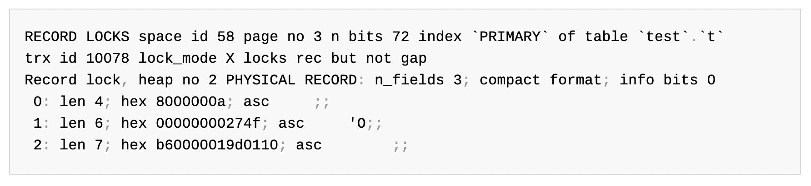

# 5. 트랜잭션과 잠금 (155~183p)

# 5.3. InnoDB 스토리지 엔진 잠금 (166~176p)

[MySQL 기반의 잠금](./2024_11_14_dil.md#52-mysql-엔진의-잠금-160176p)과 다르게 <br>
InnoDB 잠금은 스토리지 엔진에 기반한 레코드 기반 잠금을 채택하고 있습니다.

- Before
  - innodb_lock_monitor를 활성화해서 사용 - [Ref](./2024_11_15_dil.md#5311-innodb_lock_monitor-기반의-모니터링)
- After
  - information_schema의 innodb_trx, innodb_locks, innodb_lock_waits 등을 사용 가능 - [Ref](./2024_11_15_dil.md#5312-information_schema-기반의-모니터링)

## 5.3.1. InnoDB 스토리지 엔진의 잠금 (167~170p)

| Name                  | Command                     | Feature                                 | Page |
| --------------------- | --------------------------- | --------------------------------------- | ---- |
| `Record Lock`         | SHOW ENGINE INNODB STATUS\G | Record의 Index를 잠근다.                | 168p |
| `Gap Lock`            |                             | Record와 바로 인접한 Record를 잠근다.   | 168p |
| `Next Key Lock`       |                             | Record Lock과 Gap Lock이 섞인 형태이다. | 168p |
| `Auto Increment Lock` |                             |                                         |      |

### 5.3.1.1. Record Lock (169p)

`SHOW ENGINE INNODB STATUS\G` 명령어로 Record Lock을 볼 수 있습니다. - [Ref](https://dev.mysql.com/doc/refman/8.0/en/innodb-enabling-monitors.html)



### 5.3.1.2. Gap Lock (169p) 👍

Index Record 사이의 잠금
또는 첫 번째 또는 마지막 레코드 인덱스 앞뒤의 갭에 대한 잠금됩니다. - [Ref](https://dev.mysql.com/doc/refman/8.0/en/innodb-locking.html#innodb-gap-locks)

#### 5.3.1.2.1. 동일한 Connection에서는 Gap Lock이 발생하지 않는다.

START TRANSACTION, SELECT \* FROM \<table_name\> FOR UPDATE가 있더라도 <br>
단일 Connection에서의 쿼리 실행으로는 Gap Lock은 발생하지 않는다.

```sql
INSERT INTO member (m_id, m_name, m_area) VALUES (13, '이길동', '성남'), (14, '오복순', '경남'), (20, '이십순', '전남');

START TRANSACTION;
SELECT * FROM member WHERE m_id BETWEEN 10 and 20 FOR UPDATE;
INSERT INTO member (m_id, m_name, m_area) VALUES (15, '엄복동', '강원');
COMMIT;
```

#### 5.3.1.2.2. 다른 Connection 간에는 Gap Lock이 발생하지 않는다.

START TRANSACTION, SELECT \* FROM \<table_name\> FOR UPDATE가 있을때 <br>
복수의 Connection이 마주하면 후순위 실행자는 Gap Lock으로 인해 대기 상태에 빠진다.

- A Client

```sql
START TRANSACTION;
SELECT * FROM member WHERE m_id BETWEEN 10 and 20 FOR UPDATE;
COMMIT;
```

- B Client;

```sql
INSERT INTO member (m_id, m_name, m_area) VALUES (16, 'B_CLIENT', '강원');
-- A Client에서 Commit이 발생하기 전까지 이 쿼리는 성공하지 않고 멈춤
```

#### 5.3.1.2.3. START TRANSACTION & FOR UPDATE?

START TRANSACTION 혹은 FOR UPDATE가 없다면 <br>
복수의 Connection이 마주하더라도 Gap Lock이 발생하지 않는다.

- A Client

```sql
START TRANSACTION;
SELECT * FROM member WHERE m_id BETWEEN 10 and 20;
COMMIT;
```

- C Client;

```sql
INSERT INTO member (m_id, m_name, m_area) VALUES (17, 'C_CLIENT', '강원');
-- A Client에서 Commit이 발생하기 전까지 이 쿼리는 성공하지 않고 멈춤
```

### 5.3.1.3. Next Key Lock (169p)

Record Lock과 Gap Lock이 섞인 형태이다. <br>
공식 문서를 읽었는데 전체적으로 무슨 내용인지 모르겠습니다. - [Ref](https://dev.mysql.com/doc/refman/8.0/en/innodb-locking.html#innodb-next-key-locks)

### 5.3.1.4. Auto Increment Lock (170p)

AUTO_INCREMENT를 가지는 칼럼은 TRANSACTION 유무와 관계없이 이 락이 걸립니다. <br>
`innodb_autoinc_lock_mode`를 통해서 세부 모드를 조절할 수 있습니다.

| Mode | Description                                                                                                                                   |
| ---- | --------------------------------------------------------------------------------------------------------------------------------------------- |
| 0    | 모든 INSERT 문장은 Auto Increment Lock을 사용함                                                                                               |
| 1    | INSERT가 예측 가능한 상황일떄 Auto Increment Lock을 사용하지 않고 래치(무텍스)를 이용해 처리 <br> 그 외의 경우에서는 Auto Increment Lock 사용 |
| 2    | 절대로 Auto Increment Lock을 사용하지 않음                                                                                                    |

### 5.3.1.5. innodb_lock_monitor 기반의 모니터링

...

### 5.3.1.6. information_schema 기반의 모니터링

...

## 5.3.2. 인덱스와 잠금

InnoDB는 위에서 말한 [Record Lock (169p)](./2024_11_15_dil.md#5311-record-lock-169p)을 사용합니다. <br>
이때 작업 대상의 레코드의 `인덱스`에 락을 걸게 되는데, 이로 인해 Fullscan Record Lock의 위험성이 있습니다.

- 한줄 설명 : WHERE 절에 인덱스가 걸려있지 않은 조건을 걸면 풀스캔을 하고 이에 따라 Fullscan Record Lock이 발생한다.

## 5.3.3. 레코드 수준의 잠금 확인 및 해제 (172~176p)

```sql
SHOW PROCESSLIST;
+----+-----------------+-----------+------------+---------+------+------------------------+------------------+
| Id | User            | Host      | db         | Command | Time | State                  | Info             |
+----+-----------------+-----------+------------+---------+------+------------------------+------------------+
|  5 | event_scheduler | localhost | NULL       | Daemon  | 3465 | Waiting on empty queue | NULL             |
|  8 | root            | localhost | monthly_cs | Query   |    0 | init                   | SHOW PROCESSLIST |
|  9 | root            | localhost | monthly_cs | Sleep   | 1206 |                        | NULL             |
+----+-----------------+-----------+------------+---------+------+------------------------+------------------+
3 rows in set, 1 warning (0.00 sec)

SELECT
  r.trx_id waiting_trx_id,
  r.trx_mysql_thread_id waiting_thread,
  r.trx_query waiting_query,
  b.trx_mysql_thread_id blocking_thread,
  b.trx_query blocking_query
FROM       performance_schema.data_lock_waits w
INNER JOIN information_schema.innodb_trx b
ON         b.trx_id = w.blocking_engine_transaction_id
INNER JOIN information_schema.innodb_trx r
ON         r.trx_id = w.requesting_engine_transaction_id;

Empty set (0.01 sec)
```

# 5.4. MySQL의 격리 수준 (176~183p)

[4장 아키텍처 - 트렌잭션 격리 레벨(Transaction Isolation Level)](./2024_11_11_dil.md#43-트랜잭션-격리-레벨transaction-isolation-level)에서 배운 내용입니다. <br>
각 격리 수준에 대해서 조금 더 깊이 있게 배우고자 합니다.

| Level              | `DIRTY READ` | `NON-REPEATABLE READ` | `PHANTOM READ`     |
| ------------------ | ------------ | --------------------- | ------------------ |
| `READ UNCOMMITTED` | 발생         | 발생                  | 발생               |
| `READ COMMITTED`   | 없음         | 발생                  | 발생               |
| `REPEATABLE READ`  | 없음         | 없음                  | 발생 (InnoDB 없음) |
| `SERIALIZABLE`     | 없음         | 없음                  | 없음               |

모든 실습은 `@@autocommit`이 0인 상태에서만 실습할 수 있습니다. <br>
아래 SQL 쿼리를 이용해서 `@@autocommit` 값을 조회할 수 있습니다.

```sql
mysql> SELECT @@autocommit;
+--------------+
| @@autocommit |
+--------------+
|            1 |
+--------------+
1 row in set (0.00 sec)
```
